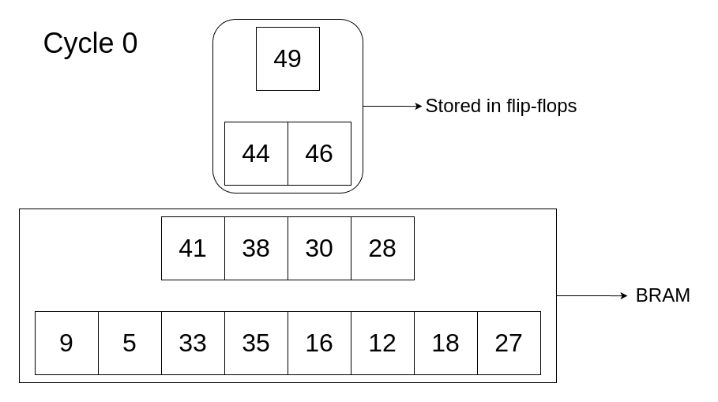

# BRAM Tree

## Description

In contrast to the pipelined BRAM-tree, this flat BRAM-tree stores all elements of the priority queue in a single contiguous BRAM block, eliminating level-based partitioning. Each node is indexed using a binary heap layout, where the parent-child relationships are determined by fixed index calculations: for a node at index $i$, its left and right children reside at $2i + 1$ and $2i + 2$, respectively. This layout simplifies memory addressing and enables the entire structure to be managed within a single memory module.

The flat BRAM-tree reduces memory overhead associated with maintaining multiple BRAM instances and allows more efficient utilization of BRAM capacity. However, since all memory operations are funneled through a single BRAM, concurrent access is serialized, resulting in higher latency for compare-and-swap operations. As a result, each replace operation may take multiple clock cycles depending on the memory access scheduling.

## Strcuture

## Performance

