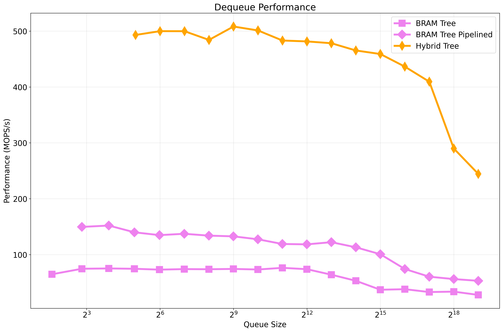

# BRAM Tree (Pipelined)

## Description

A BRAM-tree is derived from a register-tree by packing the registers at each tree level into BRAM blocks. Each level maintains an index to track the recently displaced element, allowing the compare-and-swap logic to calculate child node positions dynamically (e.g., $2 \times \text{idx}_0$ and $2 \times \text{idx}_0 + 1$). This transformation enhances scalability in two key ways: (1) the comparator logic complexity remains $O(\log N)$, and (2) memory storage is shifted from registers to BRAMs, alleviating physical layout constraints on FPGAs.

To optimize area usage, the top few levels—where node counts are small—are retained in registers rather than BRAMs, which avoids inefficient use of fixed-size memory blocks. Although BRAM access introduces additional latency, requiring multiple clock cycles per compare-and-swap operation, the design maintains scalability for large priority queues. Experimental results show that the throughput of this architecture is one replace operation every four clock cycles.

## Performance

