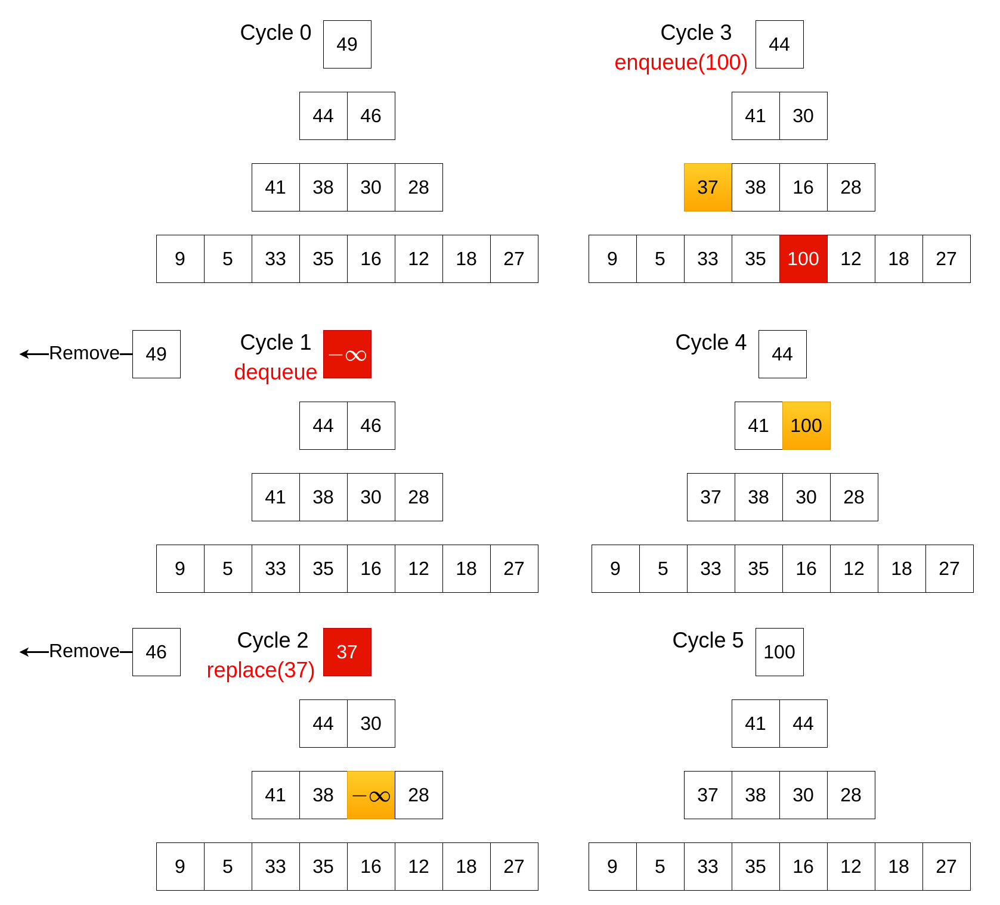
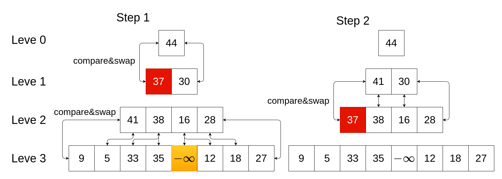
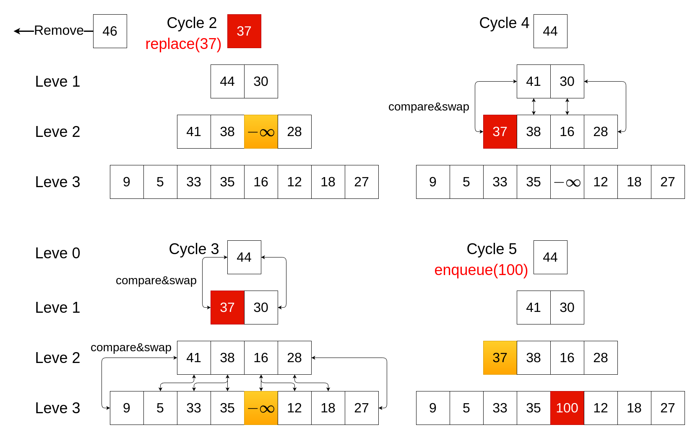
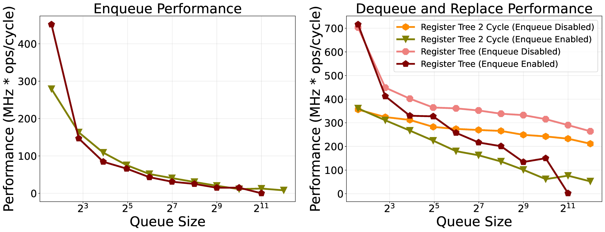

# Register Tree (Pipelined)

## Description

This is a pipelined version of the register tree architecture that divides the compare-and-swap logic between cycles, reducing the logic circuit burden during synthesis and achieving a faster clock frequency.

## Dataflow

In a standard register tree setup, as illustrated in this figure, both dequeue and replace operations complete in a single cycle, while the enqueue operation requires two cycles to propagate the new entry to its correct position.

A detailed view of the compare-and-swap operation occurring between cycle 2 and cycle 3.

Illustration of how data flows in cycle-based operation after pipelining.

## Performance comparison against non-pipelined

